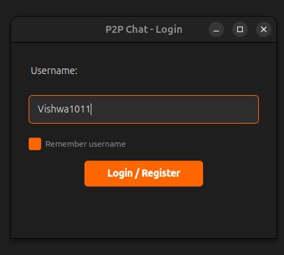
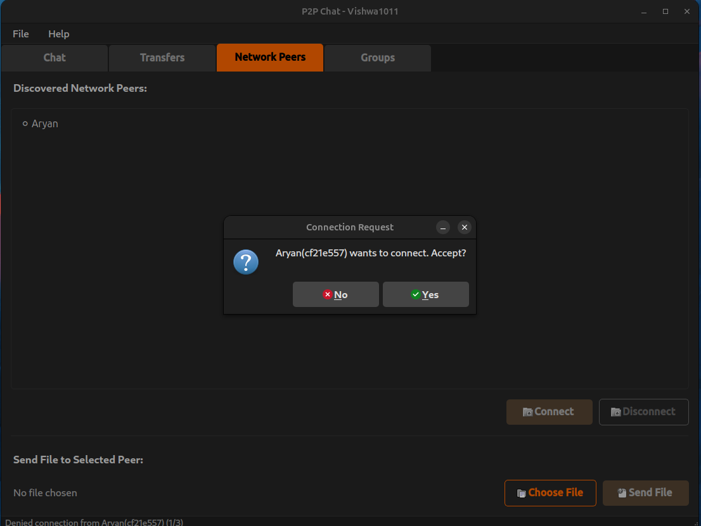
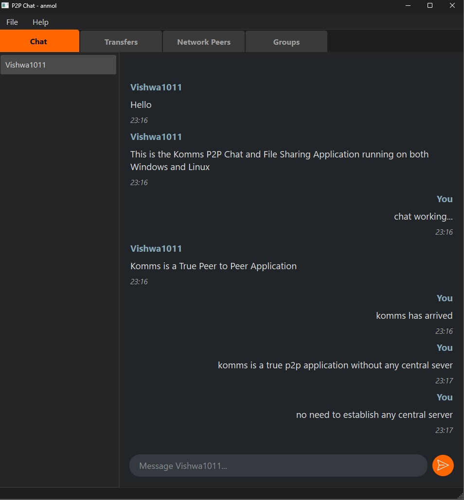
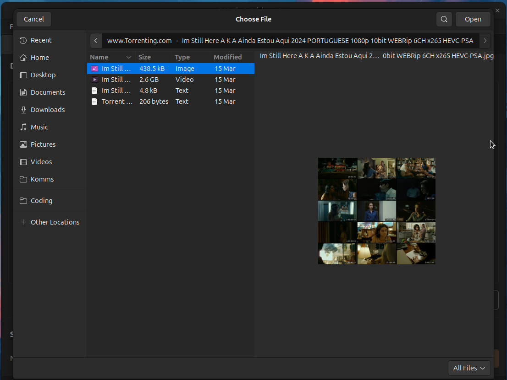
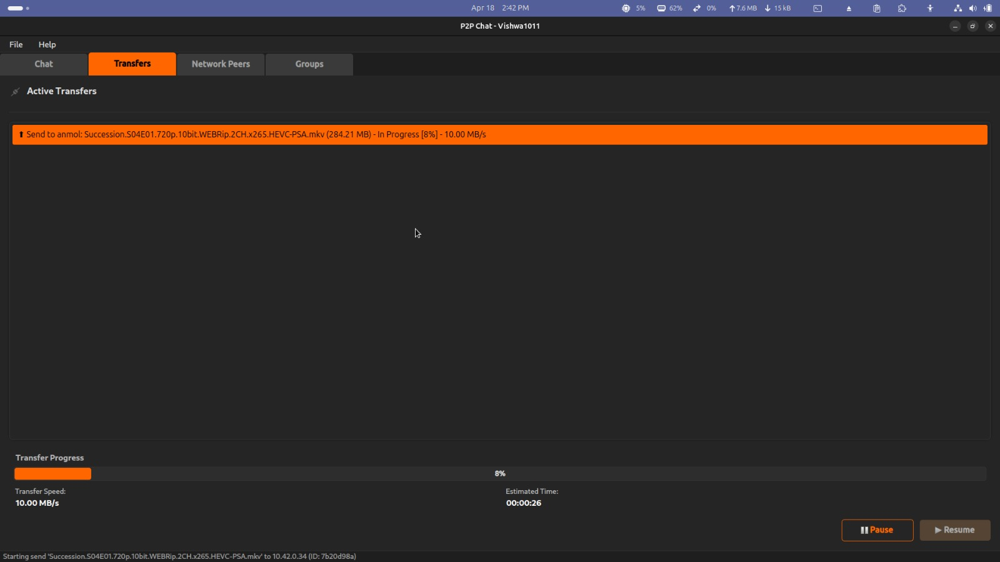
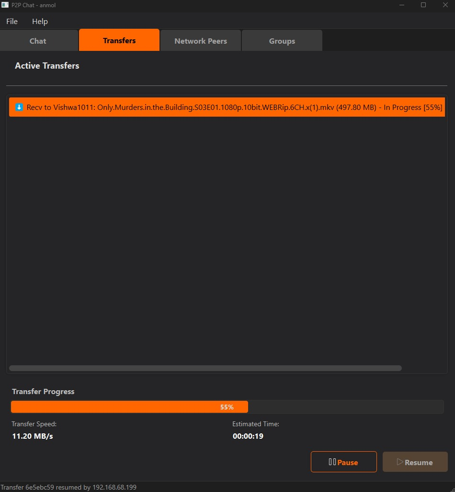

# P2P Chat and File Transfer

[](https://www.python.org/downloads/)
<!-- Add other badges if desired, e.g., License, Build Status -->

A decentralized, peer-to-peer application built in Python that enables users on a local network to discover each other, establish secure WebSocket connections, exchange encrypted messages, and transfer files. The application features a PyQt6-based Graphical User Interface alongside a command-line interface, leveraging UDP broadcasts for peer discovery, RSA encryption for secure communication, and asyncio for asynchronous operations.

## Table of Contents

- [Project Description](#project-description)
- [Screenshots](#screenshots)
- [Demo Video](#demo-video)
- [Features Implemented](#features-implemented)
  - [Frontend (GUI & CLI)](#frontend-gui--cli)
  - [Backend](#backend)
- [Technologies Used](#technologies-used)
- [Local Setup](#local-setup)
  - [Prerequisites](#prerequisites)
  - [Steps to Setup](#steps-to-setup)
- [Usage](#usage)
- [Testing (Optional)](#testing-optional)
- [Contributing](#contributing)

## Project Description

P2P Chat and File Transfer is a decentralized, peer-to-peer application built in Python. It enables users to discover peers on a local network, establish secure WebSocket Secure (WSS) connections, exchange RSA-encrypted messages, and transfer files efficiently. The application utilizes UDP broadcasts for peer discovery and `asyncio` for non-blocking operations, ensuring responsive real-time interaction. It provides both a rich Graphical User Interface (GUI) built with PyQt6 and a functional Command-Line Interface (CLI).

## Screenshots

<table>
  <tr>
    <td align="center"><br><em>Screenshot 1: GUI Login</em></td>
    <td align="center"><br><em>Screenshot 2: Connection Request from peer</em></td>
    <td align="center"><br><em>Screenshot 3: Main GUI - Chat Tab</em></td>
  </tr>
  <tr>
    <td align="center"><br><em>Screenshot 4: Main GUI - File Browser</em></td>
    <td align="center"><br><em>Screenshot 5: Main GUI - Transfers Tab - Sender</em></td>
    <td align="center"><br><em>Screenshot 6: Main GUI - Transfers Tab - Receiver</em></td>
  </tr>
</table>

*(Please replace `./assets/1.png` through `./assets/6.png` and the captions with your actual file paths and descriptions.)*

## Demo Video

Watch a demonstration of the application on YouTube:

[](https://www.youtube.com/watch?v=tHedlnqahpQ)

*(Click the image above or [this link](https://www.youtube.com/watch?v=tHedlnqahpQ) to watch the video on YouTube.)*

## Features Implemented

### Frontend (GUI & CLI)

-   **Graphical User Interface (GUI) (via `p2p_app__.py`):**
    -   User-friendly login and main window.
    -   Tabs for Chat, Transfers, Network Peers, and Groups.
    -   Real-time display of messages in individual chat windows with bubble-style formatting.
    -   Visual peer list showing discovered and connected users.
    -   Connection management (connect/disconnect buttons).
    -   File selection dialog and send functionality.
    -   Active transfers list with progress bars, speed, ETA, and pause/resume controls for outgoing transfers.
    -   Group creation, pending invitation management, and join request handling (for group admins).
    -   Pop-up dialogs for incoming connection approvals.
-   **Command-Line Interface (CLI) (via `main.py`):**
    -   Interactive prompt for sending messages, connecting to peers, and managing file transfers.
    -   Real-time display of messages and transfer progress without overlapping prompts.
    -   Approval requests for incoming connections with yes/no responses.

### Backend

-   **Peer Discovery:**
    -   Uses UDP broadcasts to announce presence and discover peers on the local network.
    -   Maintains a dynamic peer list with periodic cleanup of stale entries.
-   **Secure Messaging:**
    -   Establishes WebSocket Secure (WSS) connections.
    -   RSA public/private key encryption for all messages.
    -   Supports one-to-one messaging.
-   **File Transfer:**
    -   Asynchronous file sending/receiving with chunked transfers (1MB chunks).
    -   Pause/resume functionality for outgoing transfers.
    -   SHA-256 hash verification for file integrity.
-   **Connection Management:**
    -   Handles connection requests, approvals (with tie-breaking for simultaneous attempts), and disconnections.
    -   Tracks connection denials to prevent spam.
    -   Graceful shutdown with cleanup of resources (sockets, file handles, tasks).
-   **Shared State:**
    -   Centralized state management for peers, connections, transfers, and groups using asyncio primitives (locks, events).
-   **Group Chat (Basic):**
    -   Group creation and dynamic updates of membership.
    -   Invitation-based and request-based joining mechanisms.
-   **Security:**
    -   Self-signed SSL certificates generated for WSS.
    -   Path sanitization for file operations.

## Technologies Used

-   **Python 3.11+**: Core language for the application.
-   **asyncio**: For asynchronous I/O and task management.
-   **websockets**: For real-time peer communication over WebSocket Secure (WSS) protocol.
-   **cryptography**: For RSA encryption, secure message exchange, and SSL certificate generation.
-   **PyQt6**: For the Graphical User Interface.
-   **aiofiles**: For asynchronous file operations.
-   **aioconsole**: For non-blocking console input in the CLI (`main.py`).
-   **psutil**: For robust network interface discovery and disk space checking.
-   **uuid**: For generating unique identifiers.
-   **appdirs**: For cross-platform configuration file storage.
-   **logging**: For detailed application logging.

See `requirements.txt` for the full list of dependencies and versions.


## Local Setup

### Prerequisites

-   Python 3.11 or higher installed.
-   Git installed to clone the repository.
-   A local network environment for peer discovery (Wi-Fi or Ethernet).

### Steps to Setup

1.  **Clone the Repository:**
    ```bash
    git clone https://github.com/Vishwa1011-AFK/P2P-Project.git
    cd P2P-Project
    ```

2.  **Create a Virtual Environment:**
    ```bash
    python -m venv venv
    # On Windows
    # venv\Scripts\activate
    # On macOS/Linux
    source venv/bin/activate
    ```

3.  **Install Dependencies:**
    ```bash
    pip install -r requirements.txt
    ```

4.  **Run the Application:**
    -   **For the GUI version (recommended for full features):**
        ```bash
        python p2p_app__.py
        ```
    -   **For the CLI version:**
        ```bash
        python main.py
        ```

## Usage

-   On the first run (GUI or CLI), enter a username. This will generate a user configuration file including RSA keys and a self-signed SSL certificate.
-   **GUI:**
    -   The interface is tab-based for managing chats, transfers, peers, and groups.
    -   Discover peers in the "Network Peers" tab and connect to them.
    -   Once connected, peers will appear in the "Chat" tab's peer list. Select a peer to start chatting.
    -   Send files via the "Network Peers" tab. Monitor transfers in the "Transfers" tab.
-   **CLI (if using `main.py`):**
    -   Use commands like `/list` to see discovered peers.
    -   `/connect <username_or_ip>` to connect to a peer.
    -   `/msg <username> <message>` to send a message.
    -   `/send <username> <filepath>` to send a file.
    -   Type `/help` for a full list of available CLI commands.

### Notes

-   Ensure all devices are on the same local network for peer discovery to work.
-   The application stores user configuration (keys, username, SSL certs) in a platform-specific directory (e.g., `~/.config/P2PChat` on Linux, `%APPDATA%\YourOrg\P2PChat` on Windows) via `appdirs`.
-   To shut down, close the GUI window or use `Ctrl+C` / `/exit` in the CLI.

## Contributing

Contributions are welcome! Please feel free to submit a pull request or open an issue for bugs, feature requests, or improvements.
