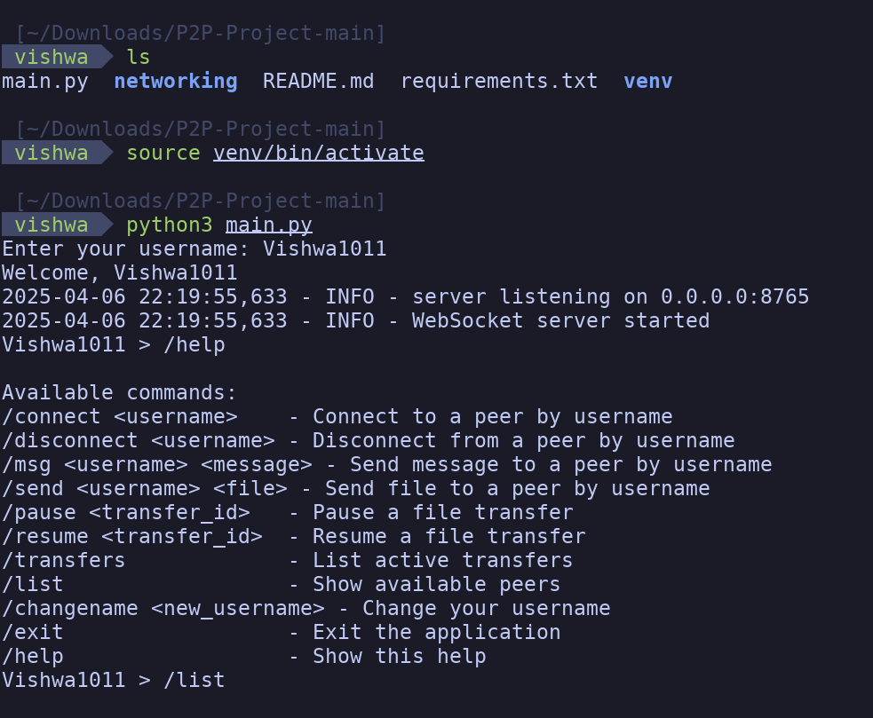
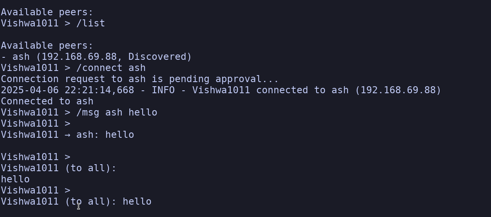
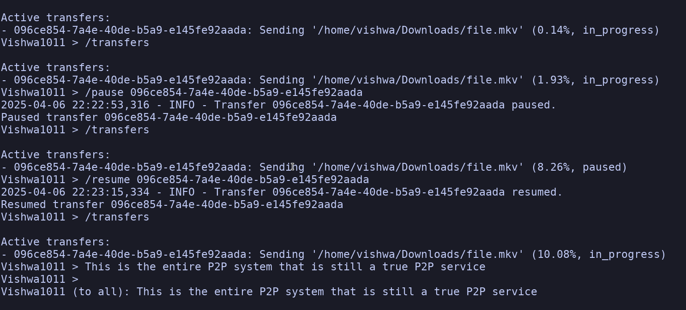
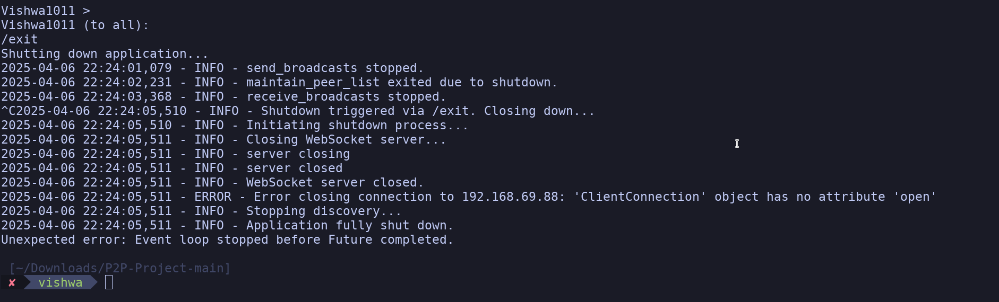

# P2P Chat and File Transfer

## Project Description
P2P Chat and File Transfer is a decentralized, peer-to-peer application built in Python that enables users to discover peers on a local network, establish secure WebSocket connections, exchange encrypted messages, and transfer files. The application leverages UDP broadcasts for peer discovery, RSA encryption for secure communication, and asyncio for asynchronous operations, ensuring efficient and real-time interaction between peers.

## Screenshots






## Features Implemented

### Frontend
- **Command-Line Interface (CLI):** 
  - Interactive prompt for sending messages, connecting to peers, and managing file transfers.
  - Real-time display of messages and transfer progress without overlapping prompts.
  - Approval requests for incoming connections with yes/no responses.

### Backend
- **Peer Discovery:** 
  - Uses UDP broadcasts to announce presence and discover peers on the local network.
  - Maintains a dynamic peer list with periodic cleanup of stale entries.
- **Secure Messaging:** 
  - Establishes WebSocket connections with RSA public/private key encryption for messages.
  - Supports one-to-one and broadcast messaging.
- **File Transfer:** 
  - Asynchronous file sending/receiving with chunked transfers (1MB chunks).
  - Pause/resume functionality and SHA-256 hash verification for integrity.
- **Connection Management:** 
  - Handles connection requests, approvals, and disconnections with denial tracking.
  - Graceful shutdown with cleanup of resources (sockets, file handles, tasks).
- **Shared State:** 
  - Centralized state management for peers, connections, and transfers using asyncio primitives.

## Technologies/Libraries/Packages Used
- **Python 3.11+**: Core language for the application.
- **asyncio**: For asynchronous I/O and task management.
- **websockets**: For real-time peer communication over WebSocket protocol.
- **cryptography**: For RSA encryption and secure message exchange.
- **aiofiles**: For asynchronous file operations.
- **aioconsole**: For non-blocking console input in the CLI.
- **netifaces**: For network interface discovery and IP address handling.
- **uuid**: For generating unique identifiers for transfers and users.
- **appdirs**: For cross-platform configuration file storage.
- **logging**: For detailed application logging.

See `requirements.txt` for the full list of dependencies and versions.

## Local Setup

### Prerequisites
- Python 3.11 or higher installed.
- Git installed to clone the repository.
- A local network environment for peer discovery (Wi-Fi or Ethernet).

### Steps to Setup the Project Locally
1. **Clone the Repository:**
   ```bash
   git clone https://github.com/Vishwa1011-AFK/P2P-Project.git
   cd P2P-Project
   ```

2. **Create a Virtual Environment:**
   ```bash
   python -m venv venv
   source venv/bin/activate  # On Windows: venv\Scripts\activate
   ```

3. **Install Dependencies:**
   ```bash
   pip install -r requirements.txt
   ```

4. **Run the Application:**
   ```bash
   python main.py
   ```

5. **Usage:**
   - On first run, enter a username to generate a user config.
   - Use commands like `/list` to see peers, `/connect <username>` to connect, `/msg <username> <message>` to chat, and `/send <username> <file>` to transfer files.
   - Type `/help` for a full list of commands.

6. **Testing (Optional):**
   - Run test scripts in `networking/testing/` (e.g., `tcp_client.py`, `udp_server.py`) to verify socket functionality:
     ```bash
     python networking/testing/tcp_server.py
     python networking/testing/tcp_client.py
     ```

### Notes
- Ensure all devices are on the same local network for peer discovery to work.
- The application stores user configuration (keys, username) in a platform-specific directory (via `appdirs`).
- Use `Ctrl+C` or `/exit` to gracefully shut down the application.
